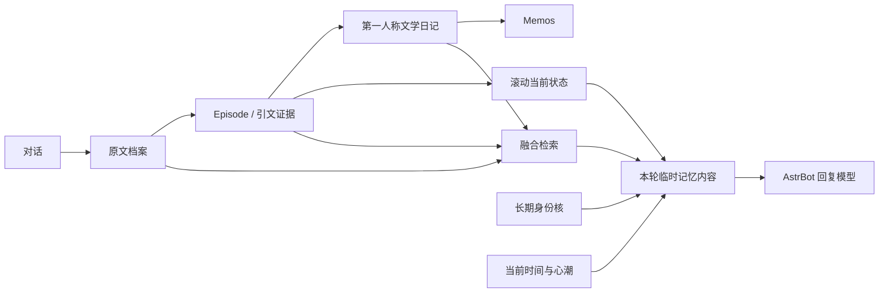
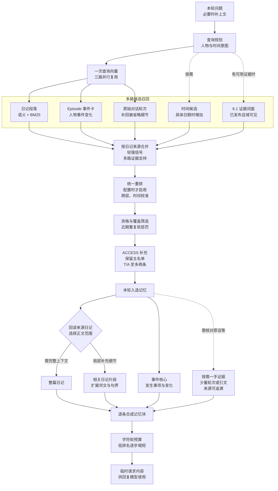

# AstrBot Memos Memory

**让角色记得经历，也记得经历怎样改变了自己。**

面向长期角色扮演的 AstrBot 记忆插件。保留原始对话证据，将经历整理为事件、第一人称文学日记与当前状态，再按问题找回需要的细节。Memos 保存日记，本地档案和索引承担追溯、检索与恢复。

**[下载 6.1.0 ZIP](https://github.com/qwqisaaczeus-netizen/astrbot_plugin_memos_memory/releases/download/v6.1.0/astrbot_plugin_memos_memory-6.1.0.zip)** · [发布说明](docs/releases/v6.1.0.md) · [安装与升级](docs/installation.md) · [架构与能力](docs/architecture.md) · [更新记录](CHANGELOG.md)

## 6.1.0

> 本版重点：统一工作台，完善证据核验与生产恢复。

6.1.0 整合 RC6 A 测试修正与清蓝界面。总览、心潮、月历、记忆生产、模型调度、补偿和控制台使用统一控件与状态颜色；统计、注入构成和同日多篇日记读取实际数据。

新生产链将精确引文抽取、解释核验、叙事规划、文学写作、审稿与发布分开，保存调用预算和中间结果。正文关联、背景参考和仅存于证据库的事实具有不同含义，避免把关联数量当作正文覆盖率。

**安装不会自动启用新日记生产，也不会重跑旧作业。** 草稿生成使用模型；发布会写入 Memos。请先阅读 [启用步骤与费用边界](docs/installation.md#启用-61-新生产)。

## 版本入口

| 版本 | 用途 | 下载与状态 |
| --- | --- | --- |
| **6.1.0** | 本次正式发布，当前稳定入口 | [Release](https://github.com/qwqisaaczeus-netizen/astrbot_plugin_memos_memory/releases/tag/v6.1.0) / [原始 ZIP](https://github.com/qwqisaaczeus-netizen/astrbot_plugin_memos_memory/releases/download/v6.1.0/astrbot_plugin_memos_memory-6.1.0.zip) |
| 5.1.0 | 历史版本，LLM Runtime 2.0 与 ACCESS 补充支路 | [V5.1.0](https://github.com/qwqisaaczeus-netizen/astrbot_plugin_memos_memory/releases/tag/V5.1.0)，保留原标签大小写 |
| 4.6.4 | 历史 4.6 维护版 | [v4.6.4](https://github.com/qwqisaaczeus-netizen/astrbot_plugin_memos_memory/releases/tag/v4.6.4) |
| 5.0.0-test0 | 历史 Shadow 预览版 | [v5.0.0-test0](https://github.com/qwqisaaczeus-netizen/astrbot_plugin_memos_memory/releases/tag/v5.0.0-test0) |

其他版本见 [全部 Releases](https://github.com/qwqisaaczeus-netizen/astrbot_plugin_memos_memory/releases)。7.1 RC 正在独立开发；本入口和 6.1.0 ZIP 不包含其更新机制或其他后续能力。旧标签、分支与 Release 继续保留。

## 记忆如何形成

原文负责一手证据，Episode 负责事件结构，日记保留角色视角，滚动状态收敛近期变化，长期身份核保留跨月稳定的关系定位与边界。记忆层不替代回复模型；动态内容通过临时请求内容参与本轮回复。

## 检索如何融合并注入

下图对应 6.1.0 默认的精简主路，需 Episode 索引可用。**检索命中片段，最终可以注入整篇；检索命中原文，也不等于把整批聊天交给回复模型。**

融合有两层：先让**语义与词面共同找到候选**，再让**同一日记的不同证据表示汇合**。段落路默认混合 `0.7 × 向量相关度 + 0.3 × 归一化 BM25`，强词面命中还可独立救援。跨路按来源合并、保留较强信号与证据支持，再统一排序；同一日记命中三路不会被塞入三次，也不会直接把三路分数相加。

| 最终内容 | 什么时候使用 | 实际注入形态 |
| --- | --- | --- |
| **整篇日记** | 排名前列的核心项、短日记、多段命中，或需要完整上下文的必要记忆 | 第一人称完整正文，配事件核心；默认 Episode 核心全文优先名额为 1，其他日记为 2，仍受具体条件与软预算影响。 |
| **日记片段** | 只需某个局部细节的补充记忆 | 最相关段落，默认前后各扩展 100 字并尽量补齐句界，保留来源日期；不是无来源的独立摘要。 |
| **原文证据** | 核对原话、日期、主体、承诺、边界或未决事项，且存在可追溯来源 | 少量原始轮次或精确引文，附在对应记忆的一手证据区；不自动展开整批原文。 |

每条记忆通常组织成「**事件核心 + 日记视角（整篇或片段）+ 按需一手证据**」。超过字符软目标时，优先缩短低排名项；最高排名项保留原形态，不为凑预算直接删除已组装的记忆，因此仍可能超出软目标。

具体的评分、全文判定、原文展开与回退路径见 [检索融合与注入说明](docs/retrieval.md)。

## 能力与运行边界

| 能力 | 6.1.0 行为 |
| --- | --- |
| 可追溯生产 | 先归档原文；新生产具备精确引文、解释核验、文学写作和审稿。启用前保留兼容生产。 |
| 融合检索 | Episode、日记 passage、原始轮次、词面与时间路线协作；新证据接入既有筛选与注入。 |
| 长期连续性 | 长期身份核与滚动状态分工；心理推断不等于历史事实。 |
| 非破坏式可达性 | 鲜明、潜伏、深层描述访问难度。ACCESS 默认 `supplement`，在主召回后最多补充 T/A 两槽，不替换或重排主名单。 |
| 脉络与一致性观察 | `thread_mode=shadow`、`consistency_mode=shadow`；脉络 Canary 需另行启用，一致性观察不改写回答。 |
| 模型调度与恢复 | 按任务配置主模型、跟接、流式和预算；已保存成果与费用记录支持审查和恢复。 |
| 心潮与小院 | 心理、身体节律与离线产物保持独立职责；心潮调度默认开启不等于开启全部心潮功能。 |
| 运维工作台 | 查看原文回链、注入构成、生产作业、模型调用、补偿、状态历史与备份。 |

完整说明及源码入口见 [架构与能力](docs/architecture.md)。精确引用成立、模型审稿通过和离线测试通过，均不能单独证明所有语义或文学质量正确。

## 开始使用

1. 下载上方固定版本 ZIP。在升级前备份插件配置、本地数据与 Memos 数据。
2. 在 AstrBot 安装 ZIP 或覆盖插件程序文件，重载插件；强制刷新 WebUI。
3. 配置 `memos_base_url`、`memos_token`、Embedding Provider 和角色名，按需选择压缩模型与 rerank。
4. 进入 WebUI 检查连接、数据与当前生产模式。默认监听 `127.0.0.1:8088`，实际地址以配置为准。

普通覆盖升级无需例行执行同步、重索引或重写历史日记。首次接入未同步的既有 Memos 数据，以及更换 Embedding 模型或维度等情况，见 [安装与升级](docs/installation.md)。

| 页面 | 内容 |
| --- | --- |
| `/` | 总览、注入构成、月份档案、设置 |
| `/production` | 原文、Episode、草稿、迁移预检与发布 |
| `/models` | 任务模型、跟接、调用参数与记录 |
| `/compensation` | 失败请求与后台恢复 |
| `/access`、`/forgetting`、`/threads` | 可达性、反馈、脉络与受控实验 |
| `/xinchao`、`/house` | 心潮、身体节律与心笺小院 |
| `/console` | 请求、检索、注入与错误诊断 |

## 验证与反馈

本次发布重新核验原始 ZIP：270 个文件、164 个 Python 文件 AST 解析、配置 JSON、压缩包 CRC、17 项 JavaScript 语法检查和 8 项清蓝 UI 契约测试通过。未在在线 AstrBot / Memos 上运行，也未调用收费模型；本轮未重跑完整运行时回归。历史 RC6 A 测试的范围与限制见 [发布说明](docs/releases/v6.1.0.md#验证范围)。

- [报告问题](https://github.com/qwqisaaczeus-netizen/astrbot_plugin_memos_memory/issues/new?template=bug_report.yml)：提供插件/AstrBot/Memos 版本、复现步骤与脱敏日志。
- [提出建议](https://github.com/qwqisaaczeus-netizen/astrbot_plugin_memos_memory/issues/new?template=feature_request.yml)：说明希望改善的具体行为。
- 请勿提交访问令牌、API key、私有配置、数据库、用户原文或未脱敏导出包。见 [反馈指南](CONTRIBUTING.md)。

第三方组件说明见 [THIRD_PARTY_NOTICES.md](THIRD_PARTY_NOTICES.md)。原始 ZIP 的长篇开发记录保留在 [随包参考](docs/reference-6.1.0-package.md)；其中历史阶段描述以当前版本说明为准。
