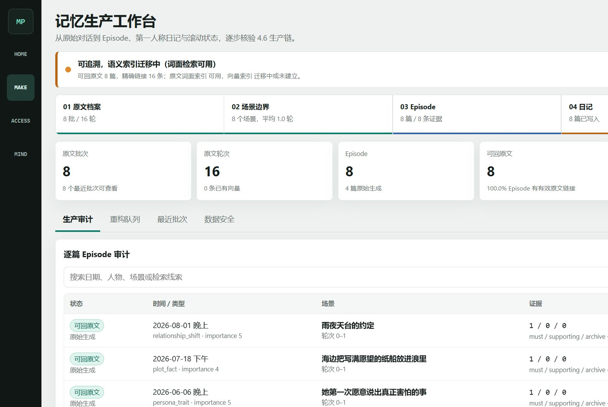
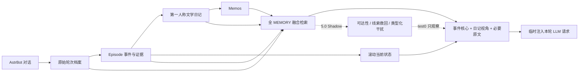
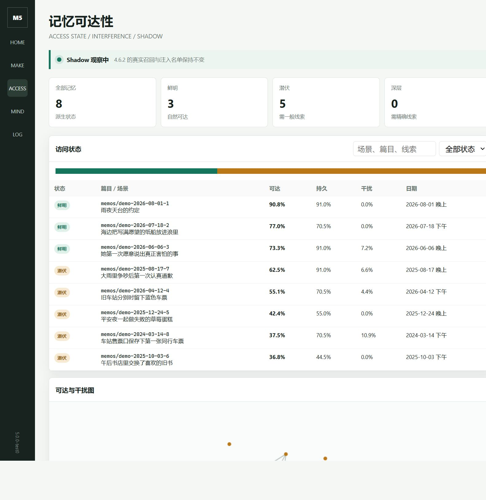

# AstrBot Memos Memory

> 面向长期角色扮演的 AstrBot 记忆系统：保留原始对话证据，把经历写成第一人称文学日记，并在需要时准确找回“发生过什么”以及“这些经历怎样塑造了现在的角色”。

[](https://github.com/AstrBotDevs/AstrBot)
[](https://github.com/usememos/memos)
[](https://github.com/qwqisaaczeus-netizen/astrbot_plugin_memos_memory/releases/tag/v4.6.2)
[](https://github.com/qwqisaaczeus-netizen/astrbot_plugin_memos_memory/releases/tag/v5.0.0-test0)



## 版本选择

| 版本 | 推荐对象 | 说明 |
| --- | --- | --- |
| **[v4.6.2 稳定版](https://github.com/qwqisaaczeus-netizen/astrbot_plugin_memos_memory/releases/tag/v4.6.2)** | 日常长期使用 | 全 MEMORY 生产、检索、注入、时间、心潮、上下文治理和备份链路均经过完整回归。 |
| **[v5.0.0-test0 预览版](https://github.com/qwqisaaczeus-netizen/astrbot_plugin_memos_memory/releases/tag/v5.0.0-test0)** | 想参与 5.0 评测 | 在 4.6.2 上新增非破坏式记忆可达层；固定 Shadow 观察，不改变真实召回与注入名单。 |

第一次使用建议安装 `v4.6.2`。已有备份、愿意观察诊断数据并反馈效果时，再选择 `v5.0.0-test0`。

## 它解决什么

普通聊天记录会越来越长；单纯摘要又会永久丢失原话、细节和时间关系。这个插件不把所有责任压在一篇摘要上，而是把长期记忆拆成互相可追溯的层：

- **原文档案**保留一手对话，日记写漏时仍能回去取证。
- **Episode 事件卡**记录人物、日期、承诺、关系转折、情绪变化和未解决事项。
- **第一人称文学日记**保留角色视角、动作、称呼、物件与完整情感弧，并写入 Memos。
- **滚动当前状态**收敛“角色现在是谁”，避免长期变化在几十篇日记里重复堆叠。
- **融合检索**同时利用 Episode、日记段落、原始轮次、BM25 和时间线索。
- **按需注入**把事件核心、文学视角和必要一手证据合成少量高密度历史记忆。
- **心潮与身体节律**表达历史如何影响此刻，但不会篡改日期、原话或事件结果。

## 记忆链路



动态记忆、当前时间、心潮等内容使用临时请求内容，不反复改写稳定 `system_prompt`。历史日记时间、现实当前时间和身体节律时间具有独立边界。

## 核心能力

### 1. 可追溯的记忆生产

压缩前先归档原始轮次，再提取可回指证据，最后生成第一人称文学日记。LLM 生成、解析、Memos 写入或证据持久化任一步失败时，缓冲不会被提前清掉。

### 2. 全 MEMORY 融合检索

一次 query embedding 并行搜索事件卡、纯正文日记 passage 与原始轮次；BM25 保护人名、昵称、物件和原话，时间问题按需增加 temporal 路。候选统一 rerank，并保护不同日期、关系阶段、承诺、边界及未解决事项。

### 3. 注意力友好注入

普通问题只注入少量强相关记忆，叙事或明确时间问题自动扩大覆盖。每条记忆保留事件核心与文学视角，原始证据只在日期、原话、争议、承诺或边界等精确问题中展开。

### 4. 长期人格与即时心理

滚动状态负责长期收敛；心潮负责当前驱动力、闪念、疲劳、睡眠、梦境和行动倾向；身体节律负责当前主观身体底色。它们相互协作，但不把心理推断写成历史事实。

### 5. 时间与上下文治理

插件严格区分现实时间、日记事件时间、Memos 来源时间和当前节律时间。AstrBot 上下文可按配置裁剪并先行备份，命令及其回复不会混入长期记忆生产。

### 6. 可诊断、可回滚

主 WebUI、记忆生产工作台、心潮工作台、Console 和 5.0 可达性页面共同提供检索实验、注入构成、原文回链、状态历史、时间洞察、备份恢复与运行日志。

## 5.0：记忆不会被删除，只会改变可达性



5.0 把“遗忘”定义为访问难度，而不是删除日记或覆盖事实。每篇记忆拥有持久性、鲜明度、独特性、证据加成、干扰负载和自然可达性，并归纳为：

- **鲜明**：可以自然进入相关召回。
- **潜伏**：需要一般语义或场景线索。
- **深层**：平时不抢占注意力，但明确日期、人物、物件或原话仍可救回。

相似记忆不会直接去重。系统会区分同一事件复述、同主题不同事件、矛盾关系阶段、因果链和表面词汇相近，避免把不同日期的日常经历错误折叠。

`v5.0.0-test0` 固定为 Shadow：真实运行、记录对照数据，但不接管 4.6.2 的正式名单。详细设计与验收见 [5.0 test0 实现报告](docs/5.0-test0-implementation-report.md)。

## 快速开始

### 准备

1. 可运行的 [AstrBot](https://github.com/AstrBotDevs/AstrBot)。
2. 可访问的 [Memos](https://github.com/usememos/memos) 服务及 Access Token。
3. AstrBot 中可用的 Chat Completion Provider。
4. 一个 Embedding Provider；rerank 可选。

### 安装

1. 从 [Releases](https://github.com/qwqisaaczeus-netizen/astrbot_plugin_memos_memory/releases) 下载所需 ZIP。
2. 在 AstrBot 插件管理中安装 ZIP，或解压到 AstrBot 的插件目录。
3. 配置 `memos_url`、`memos_token`、Embedding 与压缩模型。
4. 重载插件。

全新空库不需要执行命令。Memos 已有日记而本地尚无索引时，执行一次：

```text
/memos-reindex
```

以后在 Memos 中增删改日记，执行：

```text
/memos-sync
```

### 从旧版本升级

| 来源 | 操作 |
| --- | --- |
| `4.5.x` → `4.6.2` | 直接覆盖并重载。启动时幂等升级数据结构并保留原文、Episode、状态、画像和心潮。 |
| `4.6.2` → `5.0.0-test0` | 直接覆盖并重载。schema 6→7 前自动快照，随后后台回填可重建的可达状态和干扰关系。 |
| 更换 Embedding 模型或维度 | 覆盖后执行 `/memos-reindex`。 |
| 只是在同一模型下升级插件 | 不需要全量重建，也不要先删除本地数据库。 |

## 常用指令

| 指令 | 用途 |
| --- | --- |
| `/memos-sync` | 增量同步 Memos，并清理本地已删除的 memo。 |
| `/memos-reindex` | 全量重建 Memos 检索索引；更换 Embedding 后使用。 |
| `/memos-episodic-rebuild` | 从已有日记重建 Episode 派生视图，不改写 Memos。 |
| `/memos-state-status` | 查看滚动状态版本、字数和待融合批次。 |
| `/memos-state-rebuild` | 用现有 Episode 重新融合滚动状态，历史版本保留。 |
| `/memos-search <关键词>` | 手动检查检索结果。 |
| `/memos-buffer-status` | 查看尚未压缩的对话缓冲。 |
| `/memos-context-status` | 查看上下文治理和归档状态。 |
| `/memos-health` | 检查索引、原文回链、时间和记忆质量。 |
| `/memos-cluster-rebuild` | 4.6 重建相似诊断；5.0 开启时重建可达状态与类型化干扰图。 |
| `/memos-insight-update` | 立即更新内置时间洞察候选。 |

完整命令与全部配置字段见 [完整参考手册](docs/full-reference.md)。

## WebUI

默认地址为 `http://127.0.0.1:8088`，端口可在插件设置中修改。

| 页面 | 地址 | 主要内容 |
| --- | --- | --- |
| 主工作台 | `/` | 记忆概览、日历、召回实验室、反馈、设置、上下文与备份。 |
| 记忆生产 | `/production` | 原文、Episode、证据质量、日记生产、状态队列和数据库安全。 |
| 心潮工作台 | `/xinchao` | 动态心理、身体节律、梦境、主动表达与时间洞察。 |
| 记忆可达性 | `/access` | 5.0 三态、线索、类型化干扰图与 Shadow 对照。 |
| Console | `/console` | 每次请求的注入构成、召回链路、缓存与故障诊断。 |

## 数据边界

- Memos 是完整可阅读日记的来源；插件不会直接操作 Memos 自己的 SQLite。
- `memories.db` 保存可重建的检索派生索引。
- `episodic_memory.db` 保存原文档案、Episode、证据链接、状态版本、评测样本和 5.0 派生状态。
- 旧日记没有原始对话时会诚实标记为 `diary_derived`，不会伪造逐字证据。
- 插件默认每 14 天创建本地数据备份；WebUI 可以检查、下载和预约恢复。
- Release 包不包含 Token、配置、数据库、缓存或用户记忆。

建议同时备份 Memos 数据目录与 AstrBot 下该插件的 `plugin_data`。只备份 Memos 不会丢日记，但会失去无法从文学日记反推的一手原文和真实反馈数据。

## 文档

- [完整配置、命令与历史参考](docs/full-reference.md)
- [时间与注入边界](docs/time-and-injection.md)
- [5.0.0-test0 实现与验收报告](docs/5.0-test0-implementation-report.md)
- [版本记录](CHANGELOG.md)
- [第三方许可声明](THIRD_PARTY_NOTICES.md)

## 兼容与测试

`v5.0.0-test0` 发布前在 AstrBot `4.26.8` 与旧底包 `4.25.1` 上分别完成 289 项完整回归，5.0 专项 14 项；源码与 Release ZIP 均通过结构审计。测试环境没有 `sqlite-vec` 时会自动使用 Python cosine fallback，功能保持可用，但大库速度会较慢。

## 致谢

- [AstrBot](https://github.com/AstrBotDevs/AstrBot)
- [Memos](https://github.com/usememos/memos)
- [Xinchao Dynamic Mind](https://github.com/tianyupaipai-cmd/xinchao-dynamic-mind)
- [astrbot_plugin_period](https://github.com/Sisyphbaous-DT-Project/astrbot_plugin_period)

相关适配代码及许可信息见 [THIRD_PARTY_NOTICES.md](THIRD_PARTY_NOTICES.md)。
