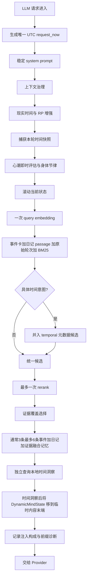

# 时间与注入架构报告

适用版本：`astrbot_plugin_memos_memory 4.6.0-test3`（兼容 4.5.4 时间/注入基线）

这份报告描述插件当前实际执行的时间来源、临时注入顺序、各模块内容、持久化边界和诊断方法。它不是配置宣传页；文中的顺序和边界对应当前代码。

## 1. 一轮请求的统一流程

每次 AstrBot 即将调用 LLM 时，插件先生成一个 UTC 请求快照 `request_now`。同一轮内需要“现在”的模块共享这个时刻，再各自转换到配置时区。



普通请求结束后，回答会进入对话缓冲。达到压缩阈值时生成日记；心潮则在回答后结算长期状态。两者不会把本轮临时提示直接写回 AstrBot 的稳定 system prompt。AstrBot 已识别的命令属于控制回合，默认走下面的隔离路径。

### 1.1 每天 23:45 的夜间记忆检查点

未达到正常压缩阈值的 pending 对话会在插件时区 23:45 后进入自适应检查。检查点对 buffer 取带序号快照，按真实跨日、两小时以上停顿和每约八轮的内容密度估算最多可提取情景数，再由证据提取层决定实际独立场景。容量不是必须凑满的篇数；同一完整情感弧不会被硬拆。

成功提交顺序固定为：原始轮次归档 -> Memos 文学日记 -> 本地段落/情景入口 -> 滚动状态更新队列 -> 时间洞察异步刷新。只有前面的日记全部持久化成功才清理对应快照；压缩期间到达的新消息序号更高，会继续留在 buffer。失败退避也绑定快照，新消息不会继承旧快照的三次失败上限。

### 1.2 指令控制回合

`context_exclude_command_turns=true` 时，插件优先读取 AstrBot 唤醒阶段已经激活的命令过滤器；只在兼容情况下用 `/命令` 文本作后备判断。命令触发的 LLM 请求不会运行普通记忆、时间、心潮注入，也不会在回答后写入长期记忆 buffer 或心潮感知。

若该命令确实走过 AstrBot Agent 并被保存，会在 `after_message_sent` 阶段按“请求前历史长度 + 本次命令指纹”删除该 user 消息及其后续 assistant/tool 结果。最近命令指纹保留 15 分钟，仅用于下一次请求尾部 16 条消息的并发兜底，不会全库扫描普通文本。发生实际删除时会把 conversation token 估算清零，让 AstrBot 重新计算。

## 2. 最终注入位置和阅读顺序

动态内容主要写入 `ProviderRequest.extra_user_content_parts`，而不是反复改写 `system_prompt`。这既保留了角色设定的稳定性，也便于 AstrBot 和 Provider 对稳定前缀做缓存。

典型顺序如下：

| 顺序 | 模块 | 容器 | 时间角色 |
|---:|---|---|---|
| 1 | `CurrentTimeContext` | 临时 user extra 首部 | 本轮唯一“现在” |
| 2 | 复读提醒、镜像动作提醒 | 临时 user extra | 当前表达约束 |
| 3 | `CurrentSemanticState` | 独立临时 user extra | 经历史收敛后的当前关系与心理状态 |
| 4 | `HistoricalMemorySet` | 临时 user extra | 一个统一历史边界与普通目标 3 条、叙事最多 6 条事件核心、日记视角、一手证据融合记忆 |
| 5 | `IntegratedHistoricalTimeInsight` | 独立临时 user extra | 有日期证据的历史回声，不是现在，不占剧情名额 |
| 6 | `DynamicMindState` | 临时 user extra 末端 | 历史对当下心理和身体的影响 |

并非每轮一定包含全部模块。滚动状态就绪后常驻；旧画像默认停止重复注入但数据和历史仍保留。时间洞察、剧情召回、心理倾向、梦境或身体信号仍要满足各自条件，空内容不会为了凑格式而注入。

### 2.1 4.4 记忆阅读顺序

4.4 把当前状态和融合历史记忆分开，避免模型从大量长日记中自行归纳“现在是谁”，同时又不牺牲日记的文学与情感表达：

1. `CurrentSemanticState` 先给出当前关系位置、承诺边界、行为倾向、近期情绪和未解决事项；它是可覆盖状态，不是事件摘要。
2. `HistoricalMemorySet` 只提供本轮需要的少量融合条目。每条以事件核心守住事实与变化，以日记视角保留完整情感弧，并在原始轮次直接相关时加入短证据。
3. 普通 RP 每条最多一项一手证据；日期、原话、承诺、边界或争议问题最多两项。证据放在对应记忆内部，不再追加第二个重复大包。
4. `DynamicMindState` 最后说明这些历史怎样影响此刻，但不得覆盖历史事实、滚动状态或当前时间。

主路只选择通过资格线与证据覆盖判断的融合记忆：普通问题目标 3 条，叙事或明确时间问题最多 6 条。事件卡、日记 passage 和原始轮次复用一个 query embedding；证据覆盖选择器保护不同日期、人物、关系阶段、承诺与状态变化，只阻止同日同事实的重复。旧 Memos 只标记为 `diary_derived`，新双阶段记忆才可标记为 `source_grounded`。

## 3. 本轮现实时间

### 3.1 时间来源

- 原始时刻：请求入口处的 `datetime.now(timezone.utc)`。
- 显示时区：`rp_time_timezone`，默认 `Asia/Shanghai`。
- 同轮复用：现实时间块、日内时段、时间捕获和身体节律都接收同一个 `request_now`。
- 精度：显示到分钟；内部快照保留秒级时间戳。

### 3.2 注入内容

现实时间块采用高优先级、单一当前时刻语义：

```text
<CurrentTimeContext priority="critical" role="only_current_now">
本轮唯一当前时间: 2026-08-02 21:36 星期日
时令: 盛夏 · 夜晚
农历/节日: ...                 # 仅在启用且有值时出现
对话节奏: 今日第 N 轮 · 距上次 ...
时间边界规则: 历史日记中的时间不是现在；剧情设定不能改写现实时间。
</CurrentTimeContext>
```

写入前会先移除插件旧轮残留的 `CurrentTimeContext`。开启劫持 Astr 默认时间时，也会清理 Astr 的简单当前时间注入，避免一轮出现两个“现在”。

### 3.3 剧情时间与现实时间

用户可以在对话中明确设定“剧情发生在某天、某年或某个季节”。这会影响剧情理解和以后日记的 `event_date`，但不会反向修改：

- 本轮真实公历日期；
- 现实身体节律的计算日期；
- Memos 的创建和更新时间；
- 本地索引时间。

因此“角色正在回忆冬天发生的事”和“现实现在是夏天”可以同时成立。

## 4. 历史日记的四种时间

插件不会只给一篇日记保留一个模糊日期，而是区分四种用途。

| 字段 | 含义 | 是否用于叙事发生顺序 |
|---|---|---|
| `occurred_at` / `event_ts` | 日记所写事件实际发生时间 | 是 |
| `time_basis` | 日期如何得到：明确、对话当前、来源推定或未知 | 用于可信度说明 |
| `source_created_ts` / `source_updated_ts` | Memos 记录创建、修改时间 | 否 |
| `indexed_ts` / `created_ts` | 本地索引建立或更新的时间 | 否 |

### 4.1 日期推定原则

优先级从高到低：

1. 日记结构化字段或正文中明确写出的完整年月日；
2. 对话明确给出的日期；
3. 只有月日时，结合 Memos 来源创建年份补全年份；
4. 无事件日期时，以 Memos 来源时间作为保守回退；
5. 没有可靠证据时标记未知，不伪造精确日期。

### 4.2 注入格式

4.4 把所有历史记忆放进一个 `HistoricalMemorySet`。集合头只说明一次当前时间边界；每条使用紧凑标题行，并按可用性携带：

- 事件日期和相对年龄；
- 记忆类型；
- 全文或段落标识；
- 事件核心；
- 完整日记或命中段落形成的文学视角；
- 与查询直接相关的 0–2 条一手证据。

`time_basis`、来源范围和主体证据仍保存在本地结构化数据中，不再在每条正文外重复一大圈规则壳，也不再把证据复制成第二个大包。

`3.2.2` 起，相对年龄也使用本轮唯一请求快照。即使请求刚好跨过午夜，现实时间块和日记年龄仍以同一时刻计算。

## 5. 整篇日记与段落注入

同步进入本地后，每篇日记仍保留完整正文，同时建立可追溯纯正文段落索引。整件事的检索线索由独立情景卡承担，不再重复混入每个 passage embedding。段落是派生索引，不会拆毁或改写 Memos 原文。

4.4 还为 `source_turns` 建立第三种独立表示。原始轮次向量只用于从一手对话中找回日记或事件卡遗漏的具体细节；命中后通过 `source_batch_id` 与证据的 `turn_indexes` 映射回 Episode。精确指针优先，只有批次级关联时降权。原始轮次正文和 Memos 都不会被迁移任务改写。

优先整篇注入的典型情况：

- 排名靠前，属于最主要的剧情依据；
- 重要性高、手动钉住或被当前相似查询确认有帮助；
- 查询需要完整事件因果；
- 日记本身不长；
- 多个段落共同命中，截取一个片段容易失真。

优先段落注入的典型情况：

- 长日记只有局部与当前话题相关；
- 次要候选用于补充人物、细节或语句线索；
- 命中段落边界清晰，并可向两侧扩展保持语义完整。

无论采用哪种模式，选择单位仍能追溯到原始 `memo_name`。相似簇只保留为 WebUI 离线观察，不参与当前精简主路。最近注入也只做软降权；连续追问同一件事时允许重新注入，不会因为临时块上一轮出现过就硬删除。

### 5.1 时间路线与旧月份索引

4.3 不在主路运行月份向量路由。只有问题包含可定位日期、月份、去年、昨天等时间意图时，才从日记的结构化时间字段补充 temporal 候选；这一支不生成第二个查询向量。月份索引与路由接口仍保留给 WebUI 浏览、消融实验和 3.x 故障回退。

## 6. 长期画像与时间洞察

### 6.1 滚动当前状态与旧画像

当前状态块为：

```text
<CurrentSemanticState role="convergent_current_self">
...
</CurrentSemanticState>
```

它描述经历最新证据后仍成立的关系位置、承诺边界、行为倾向、近期情绪和未解决事项，不宣称自己是“今天发生的事”，也不提供本轮当前日期。每次更新都是完整替换并保留版本历史。默认状态就绪后，旧 `LongTermCharacterState` 不再重复注入；旧画像继续作为首次融合种子和历史资料保存。

### 6.2 时间洞察

时间回声洞察块为：

```text
<IntegratedHistoricalTimeInsight current_date="2026-08-03" temporal_role="historical_evidence_only">
...
</IntegratedHistoricalTimeInsight>
```

它表达有日期证据的精确纪念日、近期趋势，以及只在查询相关时出现的邻近纪念日或季节模式。普通环境模式默认最多一条，并有重复冷却；明确时间问题可以独立补充最多两条，但不占 `HistoricalMemorySet` 的剧情数量。聊天请求只查询本地 SQLite，不调用 LLM；LLM 精炼只发生在周期或手动重建阶段，失败时保留确定性候选。它是对过去的观察，不是现实日历，也不能覆盖 `CurrentTimeContext`。

## 7. 心潮动态心智与身体节律

心潮只生成一个 `DynamicMindState` 临时块，并在记忆组合块之后移动到末端。模型先读“发生过什么”，再读“这些历史怎样影响此刻”。

内容按显著性组合，可能包含：

- 长期需要/情绪余波、当前激活及其综合心理值；
- 本轮话语触发的即时评估；
- 闪念、执念、行动倾向；
- 心理疲劳、睡眠状态、梦境与醒后余韵；
- 身体阶段和当前时段共同形成的主体感受；
- 对动作幅度、耐力、停顿、注意力和措辞的轻量影响。

没有显著心理或身体信号时，心潮不会每轮塞入空壳说明。

`3.2.4` 起，每个心理维度明确分成积累、激活和本轮满足。积累保存长期未满足需要或已经发生的情绪余波；激活表示近期事件把该方向推到前景的程度；满足只按实际强度部分缓解前两者。注入会把候选标成持续积累、当前仍在前景、背景倾向或情绪余波，避免模型把慢性需要与眼前刺激当成同一种紧迫度。`grieve` 和 `anger` 使用不同半衰期自然消退，闪念与执念也按真实时间衰减。

身体层与心理层只在一个块中合成。心潮最多选择一条最显著的身心关系，例如“仍想连接但身体社交余量偏低”，用于告诉模型怎样同时保留心理动机和身体限制；它不能产生新的关系、事实、情绪或动作。

### 7.1 身体节律时间

身体模块接收同一个 UTC `request_now`，再按心潮设置中的 `time_zone` 转换。阶段和日内修正分别计算：

- 早晨：05:00–12:00；
- 午后：12:00–18:00；
- 傍晚：18:00–23:00；
- 深夜：23:00–05:00。

阶段基线、每日稳定波动和阶段专属时段偏移都会平滑衔接。每日数值在当天逐渐靠近次日状态；每个时段在结束前一小时渐变到下一时段，因此跨整点和跨午夜时不会突然更换整套身体信号。WebUI 的阶段/时段名称仍按明确边界显示，名称切换不代表数值跳变。

如果 `rp_time_timezone` 和心潮 `time_zone` 不同，同一绝对时刻可能显示为不同本地日期或时段。这是明确配置造成的结果，不是取时漂移。追求直观一致时，应把两个时区设成相同值。

身体周期阶段根据持久状态中的周期起点、周期长度和当前日期计算；日内时段只做阶段上的微调，不会把历史日记中的日期套用到身体状态。

## 8. 压缩日记使用什么时间

### 8.1 每轮对话自己的记录时间

`3.2.3` 起，请求进入时会记录该轮的 UTC 时间戳和当时配置的 `rp_time_timezone`。对应的 user 消息与 assistant 回答共享同一个时间锚点，再一起写入持久缓冲。压缩时不再只给整批对话一个“现在”，而是在每一轮前提供：

```text
[对话记录时间: 2026-07-18 09:10 星期六 · 上午 · Asia/Shanghai]
user: ...
assistant: ...

[对话记录时间: 2026-07-18 21:42 星期六 · 夜晚 · Asia/Shanghai]
user: ...
assistant: ...
```

这使凌晨执行的保底压缩仍能知道事件发生在白天、傍晚还是前一天，而不会把任务执行时刻误当成剧情发生时刻。

### 8.2 执行时间只是整理参考

`auto` 和 `eod` 都会保留压缩任务自己的执行时间，用于日志和“正在何时整理”这类参考信息。但提示词明确规定：执行时间不能覆盖逐轮记录时间，Memos 写入时间也不能代替事件发生时间。

### 8.3 日期优先级

生成日记时采用以下优先级：

1. 对话正文明确给出的剧情日期或时间，写为 `time_basis=explicit_dialogue`；
2. 没有明确剧情时间时，使用该轮持久化的记录日期，写为 `time_basis=conversation_now`；
3. 只有来源时间可推断时使用来源时间；
4. 仍不可靠时写为 `unknown`，不伪造具体日期。

因此，现实记录发生在 `2026-07-18`，但用户明确说“这是去年平安夜发生的事”时，日记可以保留 `2025-12-24`，不会被现实记录时间强行改写。

### 8.4 跨午夜和多日缓冲

- 缓冲跨越多个真实日期时，目标日记数至少覆盖缓冲中出现的日期数；
- 不同日期的独立场景优先拆成不同日记；
- 同一连续场景跨过午夜且不可合理切开时，可以保留为一篇，但正文必须明确跨日过程；
- 首轮结果遗漏日期、把 `conversation_now` 写成缓冲外日期或保底压缩数量不足时，会带缺失日期清单重试一次；
- 重试仍无法可靠定位时，不把已知错误日期写入 Memos，而是降为时间未知，避免错误时间进入长期检索。

### 8.5 旧缓冲兼容

数据库升级是幂等增量迁移，不删除旧消息。旧缓冲没有逐轮 `event_ts` 时自动回退到原有 `created_ts`；新缓冲开始保存精确请求时间和时区。旧记录仍可压缩，只是分钟精度可能更接近“回答写入缓冲的时间”。

压缩提示词还要求日记保持第一人称、情感和文学完整性；一次要求多篇时返回对应数量的独立 JSON 日记；tags 进入结构化字段，若模型把 `#tag` 写进正文，持久化前会剥离合并。

## 9. 后台心理任务的时间

睡眠结算、梦境、醒后余韵、白天记忆浮现和周期维护不是某轮 LLM 请求的一部分。它们在后台任务实际运行时取得新的 UTC 当前时刻，再转换到心潮时区。这些模块不复用数小时前的请求时间。

白天记忆浮现只影响心潮的自发浮现机制，不影响普通记忆召回。其冷却窗口也不会禁止用户短时间内主动谈论同一篇日记。

## 10. 缓存与 system prompt 边界

- 稳定角色设定保留在 `system_prompt`；插件不把每轮变化的日期、滚动状态、日记和心潮写进 system。
- 动态块进入临时 user extra，因此本轮仍能被模型看到，但不会让稳定 system 前缀每轮都变化。
- 插件保留 Provider cached-token 统计、system 前缀漂移诊断和动态 system 守门。
- 内置 KB cache optimizer 已移除。插件不再识别、移动、裁剪或重新包装 AstrBot 知识库内容。

缓存命中率仍可能受 AstrBot 自身 system、历史消息、其他插件注入、Provider 计费口径和模型缓存策略影响。WebUI/Console 的数据是观测，不代表插件接管 Provider 缓存。

## 11. WebUI 中如何验证

主 WebUI 概览页提供：

- `时间模型`：是否使用同轮快照、RP 时区、最近捕获日期和时段；
- `连接状态 -> 时间模型`：RP 时区与身体时区并列显示；
- `注入构成`：最近真实请求中现实时间、滚动状态、剧情记忆、原文证据、旧画像、心潮和上下文等字符占比；
- `活动日志`：`enhancer`、`recall`、`inject`、`compress` 等真实事件；
- `召回实验室`：不污染真实会话去重状态的召回预演；
- `历史对话`：AstrBot 当前历史和插件生成的归档备份。

AstrBot 控制台中可重点查看：

```text
[memos-memory][time] 时间增强已注入: ...
[memos-memory][enhancer] 捕获当前时间: ...
[memos-memory][recall] postprocess: ...
[memos-memory][inject] ... current_time=... state=... diary=... evidence=... xinchao=... context=...
[memos-memory][compress] ... source=auto/eod recorded_dates=...
```

`current_time=0` 只可能表示该次统计没有识别到现实时间块，不等于“日志中必须单独出现一行 current_time”。正常情况下，`[time]` 和 `[enhancer] 捕获当前时间` 是时间块生成与捕获的直接证据，`[inject] current_time=...` 是最终构成证据。

`/memos-buffer-status` 会显示每个会话缓冲的真实事件时间范围。活动日志中的 `recorded_dates` 表示本次压缩实际从逐轮记录中识别出的日期，`missing_dates` 表示模型首轮或最终结果未覆盖的日期。

## 12. 推荐配置检查

1. `rp_time_timezone` 与心潮 `time_zone` 使用同一时区，除非确实需要异地身体时间。
2. 保持 Astr 默认时间劫持开启，避免双重当前时间。
3. 不要在角色固定 system prompt 中硬写会过期的“今天是某日”。
4. 剧情跨越时间时，在对话里明确年份和日期，能提高日记 `time_basis` 的可靠性。
5. 升级后不需要 `/memos-sync`、`/memos-reindex` 或段落重建；缓冲表会自动增量迁移并保留现有数据。
6. 若概览页长期没有时间样本，先进行一次真实 LLM 对话，再查看活动日志中的 `time`、`enhancer` 和 `inject`。

## 13. 已知边界

- LLM 仍可能在极长上下文中忽略提示；插件通过块语义、顺序和重复边界降低概率，但无法数学上保证模型永不口误。
- 日记日期的准确度最终受原始对话是否明确、压缩模型是否遵守 JSON 字段、旧 Memos 内容是否含可靠日期影响。
- 升级前已经进入缓冲的旧消息只有写入时刻，没有请求开始时刻；它们会安全回退，但精确分钟可能略晚于真实发言时间。
- 两个时区刻意配置不同时，界面显示差异是预期行为。
- Provider token cache 由模型服务决定，插件只能稳定自身动态注入边界并提供诊断。

## 14. 3.2.4 发布验证记录

本版发布前完成以下检查：

- 使用提供的 AstrBot 源码加载插件并校验 hook、ProviderRequest 和 WebUI 兼容性；
- Python 全包编译通过；
- 自动化回归 `59/59` 通过，覆盖旧缓冲/旧心潮状态迁移、逐轮时间持久化、跨午夜标记、跨日补篇、日期纠错、剧情时间优先和请求到回答的时间传递；
- 本地索引覆盖向量回退、BM25、混合检索、事件时间、段落追溯、反馈、锚点、关键词、月摘要、相似簇、持久缓冲、健康检查和范围删除；
- 请求钩子覆盖空索引不阻塞、同轮唯一时间快照、身体时间一致、Astr 知识库原文不被改写；
- 心潮覆盖积累/激活/分级满足、情绪自然消退、按时衰减的闪念与执念、规则/LLM 证据合并、分层心理注入、身体四阶段与四时段连续性、身心冲突、梦境、醒后余韵、白天浮现冷却、主动表达、并发保护、状态升级和原子持久化；
- WebUI 真实 HTTP 路由覆盖主页面、心潮页面、设置保存、状态接口、Console 统计和已移除 KB 接口的 404 行为；
- 主 WebUI 的 32 个前端 API 路径均能在后端路由表中找到对应处理；
- 浏览器检查 `1440×900` 桌面布局和 `390×844` 移动布局，未发现页面级横向溢出、内容重叠或页面切换失效；移动端导航的横向滚动是设计行为；
- 源目录与最终 ZIP 发布审计通过，敏感凭据模式扫描通过；
- 最终 ZIP 只有 `astrbot_plugin_memos_memory/` 一个顶层目录，不包含 `__pycache__`、`.pyc`、数据库、日志、备份或运行数据。

没有在发布检查中调用用户的真实 Memos、Embedding、Rerank 或聊天 Provider，避免写入或消耗真实服务。因此外部服务的网络可达性、额度和模型输出质量仍由安装环境决定；对应超时、缺失 Provider 和 malformed 输出的本地回退路径已由模拟测试覆盖。
