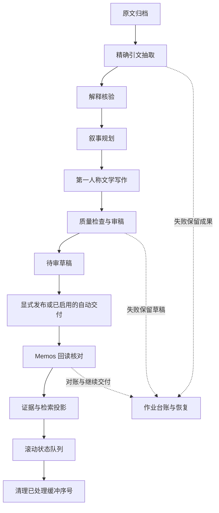

# 6.1.0 架构与能力边界

[返回首页](../README.md) · [安装升级](installation.md) · [发布说明](releases/v6.1.0.md)

本页描述 6.1.0 ZIP 内实现和默认值。设计大纲、历史测试报告与未来计划不自动等于当前线上行为。

## 数据职责

| 层 | 职责 | 主要实现 |
| --- | --- | --- |
| 原文档案 | 保存可回指的原始轮次、批次与记录时间；不能用摘要代替一手证据 | `episodic_store.py`、`archive_guard.py` |
| Episode / 证据 | 事件结构、引文、人物与解释；解释核验结果仍属于机器判断 | `diary_pipeline.py`、`generation_v2/` |
| 文学日记 | 第一人称情景与情感表达，写入 Memos；正文不承担复述全部原文的职责 | `compress.py`、`generation_v2/literary.py` |
| 检索投影 | 向量、passage、词面、时间与来源回链；派生数据可补建，缺失原文不可虚构 | `vector_store.py`、`retrieval_optimizer.py`、`generation_v2/` |
| 滚动当前状态 | 关系、承诺边界、行为倾向、近期情绪与未决事项的当前收敛 | `main.py`、`compress.py` |
| 长期身份核 | 跨月稳定的身份、关系定位、承诺和边界；低频更新 | `main.py` |
| 心潮 / 身体节律 | 此刻心理与身体底色；不改写历史日期、原话或事件结果 | `xinchao.py`、`body_rhythm.py` |

角色回复仍由 AstrBot 的回复模型生成。长期身份核、当前状态和记忆证据为本轮提供内容；它们没有接管 Planner 或替代回复模型。

## 两条生产路径

兼容生产继续处理未启用新链的批次。6.1 新生产启用后走以下路径：

解释核验区分人物归属、意图和已完成事实；`accepted`、`corrected`、`uncertain` 不代表人工真值。`uncertain` 保留原文，不允许以未经确认的解释绑定日记事实。

`literary-v4` 区分 `prose_links`、`reference_fact_ids` 和 `evidence_only_fact_ids`。程序能检查引文及正文片段存在，不能仅凭精确匹配证明语义正确。背景与证据库内容继续留存，不虚报正文覆盖率。

冻结作业合同、请求预算和中间结果，避免刷新页面或继续旧任务时无意追加调用。失败的批次保留原文；跨 Memos 和本地索引的交付采用对账与恢复流程，不能把它称作跨系统原子事务。

## 检索与非破坏式可达性

主召回利用 Episode、日记 passage、原始轮次、词面与时间路线，再统一筛选、重排和构造临时注入。新生产证据进入既有检索路径；未发布、撤回或其他作用域的新版发布记录不应进入当前召回。

ACCESS 描述自然浮现的难度，使用鲜明、潜伏、深层、线索救援和干扰关系。6.1.0 配置的 `memory_access_route_mode` 默认是 **`supplement`**：主名单先冻结，再按资格、阈值、留出和断路器条件补充至多一条时间槽 T 与一条精确救援槽 A。它不替换、不重排、不挤占主召回槽位。设为 `shadow` 时只观察，不追加。补充并不保证每轮发生。

这是保留 5.1 补充支路的行为，不能声称完整遗忘排序器已接管主召回。随包旧 README 的“正式版默认 Shadow / 单条原文金丝雀”描述属于历史阶段，不是当前配置的准确说明。

## 默认开关

| 配置 | 默认值 | 含义 |
| --- | --- | --- |
| `generation_v2_enable` | `false` | 新日记生产需明确启用 |
| `generation_v2_memos_capabilities_confirmed` | `false` | 新发布路径等待 Memos 能力确认 |
| `generation_v2_claim_audit` | `true` | 新合同使用解释核验；旧合同不自动追加阶段 |
| `generation_v2_mind_enable` | `true` | 心潮使用统一调度边界；不打开原本关闭的心潮功能 |
| `memory_access_route_mode` | `supplement` | 主召回后的有限补充 |
| `thread_mode` | `shadow` | 脉络观察；Canary 还受总开关、比例与安全条件限制 |
| `consistency_mode` | `shadow` | 回答后观测，不改写回答 |

运行时会读取用户已有配置；默认值不表示升级会覆盖用户选择。7.x 生产能力与 7.1 RC 的 ZIP/GitHub 更新机制不属于本次发布。

## 时间、费用与隐私

事件发生时间、Memos 来源时间、当前现实时间和身体节律时间分别处理。身体节律使用月历锚点；历史日记不会被当成当前正在发生的事。

模型任务有主模型、可选跟接、流式与预算配置。声明上下文窗口不会扩展供应商容量；上限并发、请求次数与 token 用量不是价格承诺。缺失用量显示未知，不能当作零费用。

语义抽取、写作、审稿、心潮及检索相关任务可能把必要内容发送到用户配置的模型服务；插件并非默认全离线。Memos 保存日记，本地数据库保存原文与派生资料。作用域隔离、备份和本机 WebUI 默认监听不能代替部署者对权限、远端服务及导出文件的管理。

## 验证边界

本轮验证了包完整性、静态语法、元数据/配置与 UI 契约，未连接在线 AstrBot / Memos，未调用收费模型。随包 RC6 A 测试报告记录一次受控真实模型样本成功，但没有真实 Memos 写入、并发压力或每晚自动生产验收。不能据此泛化为所有模型、网络条件和文学质量均稳定。

证据、作用域与故障边界需要持续使用记录和人工复核。历史设计提案保留为过程资料，当前能力以本页、实际配置和运行记录为准。
